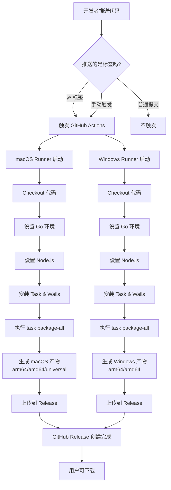

# GitHub Actions 工作流程图

## 📊 自动化发布流程



## 🔄 详细步骤分解

### 阶段 1: 触发 (Trigger)
```
开发者操作                    GitHub 响应
─────────                    ────────────
git tag v0.5.0      →       检测到 v* 标签
git push origin     →       启动工作流
  v0.5.0
```

### 阶段 2: 环境准备 (Setup)
```
每个 Runner 并行执行:
┌─────────────────────────────┐
│ 1. Checkout 代码             │
│ 2. 安装 Go (从 go.mod)       │
│ 3. 安装 Node.js v20          │
│ 4. 安装 Task                 │
│ 5. 安装 Wails CLI            │
│ 6. 验证环境 (wails3 doctor)  │
└─────────────────────────────┘
```

### 阶段 3: 构建打包 (Build & Package)
```
执行 task package-all:
┌─────────────────────────────┐
│ • 前端构建 (Vite)            │
│ • Go 编译 (CGO enabled)      │
│ • 生成 .app / .exe           │
│ • 打包 .dmg / .zip           │
│ • 添加 README & LICENSE      │
└─────────────────────────────┘
```

### 阶段 4: 发布 (Release)
```
上传产物:
┌─────────────────────────────┐
│ • 创建 GitHub Release        │
│ • 上传所有构建产物           │
│ • 自动生成 Release Notes     │
│ • 标记为正式发布             │
└─────────────────────────────┘
```

## ⏱️ 时间估算

```
步骤                      macOS      Windows
─────────────────────────────────────────────
环境准备                   2-3 min    2-3 min
依赖安装                   3-5 min    3-5 min
前端构建                   2-3 min    2-3 min
Go 编译                    3-5 min    3-5 min
打包 (.dmg/.zip)           1-2 min    1-2 min
上传到 Release             1-2 min    1-2 min
─────────────────────────────────────────────
总计                      12-20 min  12-20 min
```

**注意**: 两个平台并行构建，总时间约 15-20 分钟

## 📁 文件流转

```
本地开发环境                    GitHub Actions                GitHub Release
────────────                    ──────────────                ──────────────
                                    
源代码 ───push tag──→         Runner 接收代码                    
                                  ↓                            
                              构建产物                         
                              bin/releases/                  
                                  ↓                            
                          ┌────────────────┐                 
                          │ *.dmg (macOS)  │                 
                          │ *.zip (Win)    │                 
                          └────────────────┘                 
                                  ↓                            
                              自动上传                         
                                  ↓                            
                          ✅ Release vX.Y.Z                  
                          📦 所有平台产物                     
                          📝 Release Notes                   
                                  ↓                            
                            用户可下载 ⬇️                    
```

## 🎯 关键节点

### 1. 标签推送
```bash
git tag v0.5.0          # 创建标签
git push origin v0.5.0  # 触发 CI/CD ⚡
```

### 2. 构建中
- 访问 Actions 页面查看实时日志
- 状态: 🟡 Queued → 🟡 In Progress

### 3. 构建完成
- 状态: 🟢 Success
- Release 自动创建
- 邮件通知（如果启用）

### 4. 构建失败
- 状态: 🔴 Failed
- 查看日志定位问题
- 修复后重新推送标签

## 🔍 监控检查点

### 检查点 1: 工作流是否触发
```
位置: GitHub → Actions → Release Build
期望: 看到新的运行记录
状态: ✓ 有记录 / ✗ 无记录
```

### 检查点 2: 环境准备是否成功
```
位置: 点击运行记录 → 查看步骤
期望: Setup Go, Setup Node.js 都显示绿色对勾
状态: ✓ 成功 / ✗ 失败
```

### 检查点 3: 构建是否完成
```
位置: Build and Package All Platforms 步骤
期望: 看到 "DMG 打包完成" 或 "打包完成" 消息
状态: ✓ 完成 / ✗ 失败
```

### 检查点 4: Release 是否创建
```
位置: GitHub → Releases
期望: 看到新版本，包含所有平台产物
状态: ✓ 已创建 / ✗ 未创建
```

## 🛠️ 常用命令速查

```bash
# 查看本地标签
git tag -l

# 删除错误标签
git tag -d v0.5.0
git push origin :refs/tags/v0.5.0

# 重新打标签
git tag v0.5.0
git push origin v0.5.0

# 查看远程标签
git ls-remote --tags origin

# 查看 Actions 状态（需要 gh CLI）
gh run list --workflow=release.yml
```

## 📊 成功示例

```
✅ 推送标签: v0.5.0
✅ 触发工作流: Release Build #123
✅ macOS 构建: 成功 (15 min)
✅ Windows 构建: 成功 (14 min)
✅ Release 创建: haoyun-music-player v0.5.0
✅ 产物上传: 5 个文件
   - haoyun-music-player_v0.0.XXX_macOS_arm64.dmg
   - haoyun-music-player_v0.0.XXX_macOS_amd64.dmg
   - haoyun-music-player_v0.0.XXX_macOS_universal.zip
   - haoyun-music-player_v0.0.XXX_Windows_arm64.zip
   - haoyun-music-player_v0.0.XXX_Windows_amd64.zip
```

---

**提示**: 将此文件保存为参考，方便快速了解整个自动化流程！
